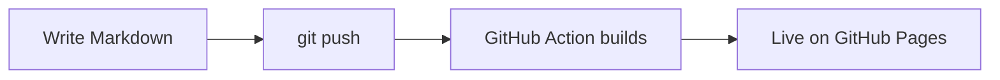

Everything here works with **zero configuration**. Use this post as a cheat-sheet, then delete it.

## Text formatting

You get **bold**, *italic*, ~~strikethrough~~, `inline code`, and [links](https://quartz.jzhao.xyz). Footnotes work too.[^1]

[^1]: Like this one.

## Callouts

> [!note] These are Obsidian-style callouts
> Use them for tips, warnings, and asides.

> [!warning] They come in many types
> `note`, `tip`, `warning`, `example`, `quote`, and more.

## Code with syntax highlighting

```python
def greet(name: str) -> str:
    return f"Hello, {name}!"

print(greet("world"))
```

```typescript
const posts = ["welcome", "features"]
posts.forEach((p) => console.log(`content/posts/${p}.md`))
```

## Math (LaTeX)

Inline math like $e^{i\pi} + 1 = 0$, and display math:

$$
\int_{-\infty}^{\infty} e^{-x^2}\,dx = \sqrt{\pi}
$$

## Tables

| Feature   | Enabled | Notes                     |
| --------- | :-----: | ------------------------- |
| Search    |   ✅    | Full-text, press `/`      |
| Graph     |   ✅    | See the panel on the right |
| RSS feed  |   ✅    | At `/index.xml`           |
| Dark mode |   ✅    | Toggle in the top-left    |

## Task lists

- [x] Fork / use this template
- [x] Change `pageTitle`
- [ ] Write your first real post
- [ ] Tell people about it

## Diagrams (Mermaid)



## Images

Drop an image into `content/` and reference it. Remote images work too:


---

That's the tour. Head back to the [[index|home page]] or read the [[posts/welcome|welcome post]] again.
